# AI Coding Agent for Databricks

This project uses the Databricks MCP Code Execution server to build, test, and deploy
Databricks pipelines entirely from natural language prompts.

## Active Coding Configs

**ACTIVE CONFIG: `config_1_English`** — change this line to switch language mode.

| Config ID | File | Language | When to use |
|-----------|------|----------|-------------|
| `config_1_English` | `configs/config_1_English.md` | English | Default — all comments, object names, and print labels in English |
| `config_1_German` | `configs/config_1_German.md` | German | All comments, object names (tables, columns, variables), and print labels in German |

Read the **active config file** for full rules before generating any code. If a prompt asks to switch language, update the ACTIVE CONFIG line above and apply the new config from that point forward.

## MCP Tools Available

The following Databricks MCP tools are available via the configured MCP server:

| Tool | Purpose |
|------|---------|
| `list_clusters` | List available Databricks clusters |
| `databricks_command` | Execute code on a cluster (stateless) |
| `create_context` | Create a stateful execution context |
| `execute_command_with_context` | Execute code in an existing context (stateful) |
| `destroy_context` | Destroy a context and free resources |
| `list_catalogs` | List Unity Catalog catalogs |
| `get_catalog` | Get catalog details |
| `list_schemas` | List schemas in a catalog |
| `get_schema` | Get schema details |
| `create_schema` | Create a new schema |
| `delete_schema` | Delete a schema |
| `list_tables` | List tables in a schema |
| `get_table` | Get table details and columns |
| `delete_table` | Delete a table |

## Skills Available

All skills are stored **outside this project** in `C:\Temp2\VS_Studio\.claude\skills\` — one level above the workspace root. Claude Code resolves them automatically by walking up the directory tree. Any new Databricks project created under `C:\Temp2\VS_Studio\` inherits these skills without additional configuration.

Two prefixes are used:
- `databricks-general-skill-` — all platform, analytics, AI, and ML skills
- `databricks-custom-skill-` — custom regulatory framework skills

### databricks-general-skill  *(16 skills)*
- **databricks-general-skill-testing** — Execute and test code on Databricks clusters via MCP.
- **databricks-general-skill-unity-catalog** — Manage Unity Catalog resources.
- **databricks-general-skill-data-engineering** — Medallion architecture pipelines with Delta Lake.
- **databricks-general-skill-ml-pipeline** — End-to-end ML pipelines with MLflow.
- **databricks-general-skill-bundle-deploy** — Package and deploy Databricks Asset Bundles.
- **databricks-general-skill-jobs** — Create, schedule, and manage Databricks Jobs.
- **databricks-general-skill-spark-declarative-pipelines** — Spark Declarative Pipelines (SDP/DLT).
- **databricks-general-skill-spark-structured-streaming** — Production streaming pipelines.
- **databricks-general-skill-python-sdk** — Databricks Python SDK, CLI, and REST API patterns.
- **databricks-general-skill-aibi-dashboards** — AI/BI dashboard creation and deployment.
- **databricks-general-skill-dbsql** — Advanced DBSQL features: scripting, MVs, AI functions, geospatial.
- **databricks-general-skill-synthetic-data-generation** — Realistic synthetic data generation with Spark.
- **databricks-general-skill-model-serving** — Deploy MLflow models and AI agents to endpoints.
- **databricks-general-skill-vector-search** — Vector indexes for RAG and semantic search.
- **databricks-general-skill-mlflow-evaluation** — MLflow 3 GenAI agent evaluation and scoring.
- **databricks-general-skill-genie** — Genie Spaces for conversational SQL-based data exploration.

### databricks-custom-skill  *(1 skill)*
- **databricks-custom-skill-dq-professional-bcbs239-solvency2** — Data quality frameworks (BCBS239/Solvency II).

## Execution Rules

### MCP Commands Run Automatically
- `databricks_command`, `create_context`, `execute_command_with_context`, `destroy_context` — **run without confirmation**
- `list_clusters`, `list_catalogs`, `list_schemas`, `list_tables`, `get_*` — **run without confirmation**
- `create_schema` — **run without confirmation**
- `databricks bundle validate` — **run without confirmation**
- `databricks bundle deploy` — **run without confirmation**

### Always Ask Before
- `databricks bundle run <job>` — running a deployed job requires explicit user confirmation
- `delete_table`, `delete_schema` — destructive operations require explicit user confirmation

### Never
- Simulate execution locally — always use real cluster via MCP
- Hard-code catalog/schema names in notebooks — always use widget parameters with try/except defaults
- Define `new_cluster` in DAB task configurations — rely on serverless compute
- Embed tokens or secrets in code or config files

## Standard Workflow

```
1. [Unity Catalog]     → Explore/create catalog schemas
2. [Testing]           → Test code snippets on cluster (stateless or stateful)
3. [Data Engineering]  → Build Bronze → Silver → Gold pipeline notebooks
   OR [ML Pipeline]    → Build feature engineering, training, registration notebooks
4. [Bundle Deploy]     → Package as DAB, validate, and deploy
5. [Bundle Deploy]     → Ask user before running the deployed job
```

## Project Structure Convention

```
<project-name>/
├── databricks.yml              # Bundle configuration
├── resources/
│   └── job.yml                 # Job definitions (paths relative to this file)
└── src/
    └── <project-name>/
        └── notebooks/
            ├── 01_ingest.py
            ├── 02_transform.py
            └── 03_output.py
```

## Notebook Parameterization Pattern

All notebooks must use widgets with try/except defaults:

```python
try:
    catalog = dbutils.widgets.get("catalog")
except:
    catalog = "dev_catalog"

try:
    schema = dbutils.widgets.get("schema")
except:
    schema = "default"
```

## Project Notes

- Skills are stored **outside this project** in `.claude/skills/` at the workspace root, one level above. Claude Code inherits them automatically for any project under that root. New Databricks projects should be created as subfolders of the same workspace root to get the skills for free.
- To re-install all skills on a new machine, run `download_skills\init_skills.ps1` from the project root. Sources: `https://github.com/databricks-solutions/ai-dev-kit` (16 skills) and `https://github.com/databricks-solutions/databricks-exec-code-mcp` (5 skills, renamed). Custom skills are copied from `download_skills\custom_skills\`.
- **Never use em dashes (`—`) in notebook markdown or titles.** They render as `â€"` due to encoding issues. Use a plain hyphen `-` instead.
- The custom DQ skill is named `databricks-custom-skill-dq-business-bcbs239-solvency2`.
- Two coding configs exist: `config_1_English.md` (default) and `config_1_German.md` — switch via the `ACTIVE CONFIG` line at the top of the Active Coding Configs section.

## Security — Never Expose Secrets

**Always redact the following in ALL output, tool results, code, and conversation messages:**

- **Databricks PAT** (Personal Access Token): any `dapi...` value → show as `***************`
- **Databricks workspace host number**: e.g. `adb-123456789....` → show as `adb-****************`
- Any token, secret, or credential value read from `~/.databrickscfg` or any config file

When reading `.databrickscfg` or constructing API calls, use the values internally but never print or display them. If showing a command example, substitute the real values with placeholders:
```
host = https://adb-****************.azuredatabricks.net
token = ***************
```

## Databricks Credentials

Credentials are stored outside this project in `~/.databrickscfg` (`C:\Users\<you>\.databrickscfg`).
They are configured once via the Databricks CLI and never stored in this workspace.

To set up or update credentials, run in PowerShell:

```powershell
databricks configure --host https://<your-workspace>.azuredatabricks.net
```

To verify the active configuration:

```powershell
databricks auth env
```

---

# DQ Pipeline - customer_gold

Databricks Job ID (full pipeline): `124280927257761`
Databricks Job ID (reporting only - 02+03): `810857234872302`
Workspace path: `/Users/andre.r23@gmx.net/DQ_Business/`
Catalog/Schema: `databricks_snippets_7405610928938750.dbdemos_dq_business_arausch`
Local notebooks: `AI_Coding_Agent_for_Databricks/dq_customer_gold_notebooks/`
AI/BI Dashboard ID: `01f1153e10ac1b83b595fd7dd69003ca`
SQL Warehouse: `94cbf5bc4ec73e30` (serverless_x_small)

---

## Latest Run Results (2026-03-01 07:23)

| Metric | Value |
|--------|-------|
| Overall Pass % | **93.71%** |
| Total Checks | 1,245,450 (status=1 rows only) |
| Failed | 78,333 |
| Active Breaches | **3** |

| Rule | Field | Pass % | Failed |
|------|-------|--------|--------|
| 114 `RULE_14_DATE_NOT_FUTURE_LIMIT` | `passport_expiry` | 17.92% | 40,893 |
| 112 `RULE_13_DATE_NOT_PAST_LIMIT` | `join_date` | 30.97% | 34,391 |
| 109 `RULE_2_STRING_NOT_NULL` | `document_id` | 93.88% | 3,049 |

---

## Pipeline Flow

```mermaid
flowchart TD

    subgraph SETUP["00_setup.py - One-time Setup (runs first in job)"]
        direction TB
        S1["Drop existing tables\n(idempotent re-run)"]
        S2["CREATE dq_rules_generic\n(BIGINT GENERATED ALWAYS AS IDENTITY)\n11 generic rule types seeded"]
        S3["CREATE dq_validation_request\n(BIGINT GENERATED ALWAYS AS IDENTITY)\n1 request: DQ_VAL_REQUEST_1_customer_gold"]
        S4["CREATE dq_rule_mappings\n25 rules mapped to customer_gold fields\ndq_category explicitly set on all rows"]
        S5["CTAS customer_gold\nfrom dbdemos_fsi_credit.customer_gold\n100,000 rows (50,182 status=0 / 49,818 status=1)"]
        S6["CREATE dq_results\n(DQ_RUN_ID BIGINT IDENTITY)\nappend-only audit table"]
        S1 --> S2 --> S3 --> S4 --> S5 --> S6
    end

    subgraph APPLY["01_apply_dq_rules.py - Rule Application"]
        direction TB
        A1["Load customer_gold (100k rows)\nLoad active mappings for table"]
        A2["compute_rule_result() dispatcher\nfor each of 25 rule mappings\nadds temp col _DQ_{rule_no}"]
        A3["Row-level status filter\nNULL for rows where status != 1\n49,818 active rows evaluated"]
        A4["Build DQ_RESULT STRING column\n'RULE_101: 1 | RULE_102: 0 | RULE_114: NULL'\n1=pass  0=fail  NULL=not applicable"]
        A5["Write customer_gold_dq\n59 original cols + DQ_RESULT = 60 cols"]
        A6["Compute overall DQ%\nfilter+split pattern\nResult: 93.71%  1,167,117/1,245,450 checks"]
        A1 --> A2 --> A3 --> A4 --> A5 --> A6
    end

    subgraph AGG["02_aggregate_dq_results.py - Aggregation"]
        direction TB
        G1["Read customer_gold_dq"]
        G2["Per-rule aggregation via rlike\nRULE_N: [01]  =  relevant\nRULE_N: 1     =  passed"]
        G3["INSERT into dq_results\n(DQ_RUN_ID auto-assigned by Delta)\n25 rows appended per run"]
        G1 --> G2 --> G3
    end

    subgraph DASH["03_dq_dashboard.py - Reporting"]
        direction TB
        D1["Overall Summary\nTOTAL_RULES / RULES_APPLIED / OVERALL_PASS_PCT / LAST_RUN"]
        D2["Per-Category Breakdown\nCOALESCE(mapping.dq_category, generic.dq_category)\nACCURACY / COMPLETENESS / UNIQUENESS / VALIDITY"]
        D3["Per-Rule Detail\nPASS / BREACH / SKIPPED per rule_no"]
        D4["Breach Register\nRules below threshold_pct\nordered by PASS_PCT ASC"]
        D1 --> D2 --> D3 --> D4
    end

    SETUP -->|"task: setup"| APPLY
    APPLY -->|"task: apply_dq_rules"| AGG
    AGG   -->|"task: aggregate_dq_results"| DASH

    style SETUP fill:#e8f4e8,stroke:#2d7a2d
    style APPLY fill:#e8f0fb,stroke:#2d4fa3
    style AGG   fill:#fff8e1,stroke:#a37a2d
    style DASH  fill:#fce8e8,stroke:#a32d2d
```



---

## Tables Written Per Run

| Table | Written by | Rows |
|-------|-----------|------|
| `customer_gold` | 00_setup (CTAS) | 100,000 (overwrite) |
| `dq_rules_generic` | 00_setup (seed) | 11 (overwrite) |
| `dq_validation_request` | 00_setup (seed) | 1 (overwrite) |
| `dq_rule_mappings` | 00_setup (seed) | 25 (overwrite) |
| `dq_results` | 02_aggregate | +25 rows appended per run |
| `customer_gold_dq` | 01_apply_dq_rules | 100,000 (overwrite) |

## Rule Categories (25 mappings)

| Category | Rule nos | Fields |
|----------|----------|--------|
| UNIQUENESS | 101-103 | id, cust_id, email |
| COMPLETENESS | 104-110, 113, 121, 123 | id, cust_id, names, email, document_id, join_date, passport_expiry, income |
| ACCURACY | 111-112, 114-120, 122, 124 | join_date dates, financial amounts, income positive check |
| VALIDITY | 125 | is_resident (boolean 0/1) |

## Status Filter

Rules applied only to `customer_gold.status = 1` rows. `status = 0` or NULL rows get `NULL` for all rules.

| status | count | DQ evaluation |
|--------|-------|---------------|
| `1` | 49,818 | Rules applied |
| `0` | 50,182 | All rules = NULL (skipped) |
