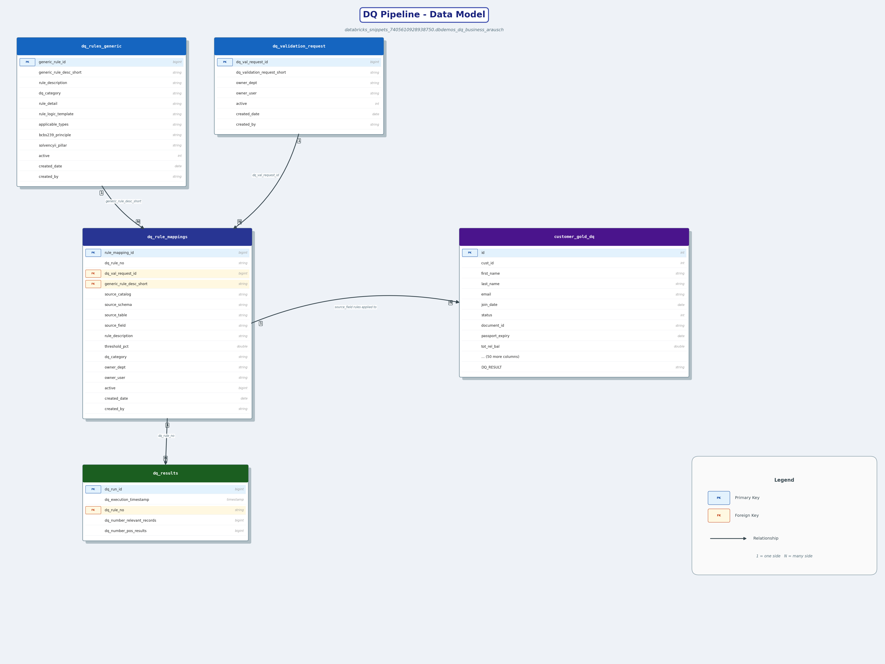
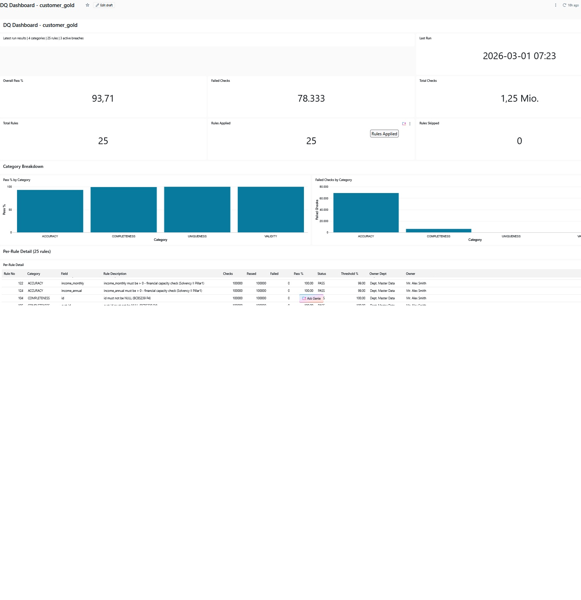

# Using Claude Code as an AI Coding Agent for creating a Databricks Custom Skill DQ-Business

**GitHub:** https://github.com/andregit2026/Databricks_DQ_Business

## DQ Pipeline - Data Model

The diagram below shows all tables written by the DQ pipeline and their relationships.



| Table | Written by | Purpose |
|-------|-----------|---------|
| `dq_rules_generic` | `00_setup` | Generic rule catalogue (BCBS239 / Solvency II rule types) |
| `dq_validation_request` | `00_setup` | Validation request owner and metadata |
| `dq_rule_mappings` | `00_setup` | Maps generic rules to specific source fields with thresholds |
| `dq_results` | `02_aggregate_dq_results` | Append-only audit log - one row per rule per run |
| `customer_gold_dq` | `01_apply_dq_rules` | Source table enriched with `DQ_RESULT` string column |

### Sample Data - `customer_gold` Entity

The tables below show live sample data from a single DQ pipeline run against the `customer_gold` table (49,818 records evaluated, 2026-03-01).

#### AI/BI Dashboard



> The AI/BI dashboard visualises pass rates by DQ category, trend lines over time, and per-rule drill-down for the `customer_gold` entity.

---

#### `dq_rules_generic` - Generic Rule Catalogue (10 of 13 rules)

| ID | Rule | Category | Description | BCBS239 | Solvency II |
|----|------|----------|-------------|---------|-------------|
| 1 | RULE_1_DATE_NOT_NULL | COMPLETENESS | Date Not Null | P3,P4 | Pillar1,QRT |
| 2 | RULE_2_STRING_NOT_NULL | COMPLETENESS | String Not Null | P3,P4 | Pillar1,QRT |
| 3 | RULE_3_NUMERIC_NOT_NULL | COMPLETENESS | Numeric Not Null | P3,P4 | Pillar1 |
| 4 | RULE_10_NUMERIC_NON_NEGATIVE | ACCURACY | Numeric Non-Negative | P3 | Pillar1 |
| 5 | RULE_11_NUMERIC_POSITIVE | ACCURACY | Numeric Positive | P3 | Pillar1 |
| 6 | RULE_12_DATE_NOT_FUTURE | ACCURACY | Date Not in Future | P3 | QRT |
| 7 | RULE_13_DATE_NOT_PAST_LIMIT | ACCURACY | Date Within Reasonable Past | P3,P5 | Pillar1 |
| 8 | RULE_20_ISO_COUNTRY_CODE | VALIDITY | ISO 3166-1 Alpha-2 Country Code | P3 | QRT |
| 9 | RULE_21_BOOLEAN_FLAG | VALIDITY | Boolean Flag (0 or 1) | P3 | Pillar2 |
| 10 | RULE_30_UNIQUE_IDENTIFIER | UNIQUENESS | Unique Identifier | P3 | Pillar1 |

---

#### `dq_rule_mappings` - Rule-to-Field Mappings for `customer_gold` (first 10 of 25)

| Mapping ID | DQ Rule | Source Field | Description | Threshold | Category | Owner Dept |
|-----------|---------|--------------|-------------|-----------|----------|------------|
| 101 | DQ_101_UNIQUE_IDENTIFIER_id | id | id must be unique across all customer records | 100% | UNIQUENESS | Dept. Master Data |
| 102 | DQ_102_UNIQUE_IDENTIFIER_cust_id | cust_id | cust_id must be unique | 100% | UNIQUENESS | Dept. Master Data |
| 103 | DQ_103_UNIQUE_IDENTIFIER_email | email | email must be unique - no duplicate customer records | 100% | UNIQUENESS | Dept. Master Data |
| 104 | DQ_104_NUMERIC_NOT_NULL_id | id | id must not be NULL | 100% | COMPLETENESS | Dept. Master Data |
| 105 | DQ_105_NUMERIC_NOT_NULL_cust_id | cust_id | cust_id must not be NULL | 100% | COMPLETENESS | Dept. Master Data |
| 106 | DQ_106_STRING_NOT_NULL_first_name | first_name | first_name must not be NULL or empty | 100% | COMPLETENESS | Dept. Master Data |
| 107 | DQ_107_STRING_NOT_NULL_last_name | last_name | last_name must not be NULL or empty | 100% | COMPLETENESS | Dept. Master Data |
| 108 | DQ_108_STRING_NOT_NULL_email | email | email must not be NULL or empty | 100% | COMPLETENESS | Dept. Master Data |
| 109 | DQ_109_STRING_NOT_NULL_document_id | document_id | document_id must not be NULL - required for KYC | 100% | COMPLETENESS | Dept. Master Data |
| 110 | DQ_110_DATE_NOT_NULL_join_date | join_date | join_date must not be NULL | 100% | COMPLETENESS | Dept. Master Data |

---

#### `dq_results` - Audit Log (first 10 rows from `customer_gold` run, 2026-03-01)

| Run ID | Execution Timestamp | DQ Rule | Relevant Records | Passed |
|--------|---------------------|---------|-----------------|--------|
| 1 | 2026-03-01 19:22:37 UTC | DQ_101_UNIQUE_IDENTIFIER_id | 49,818 | 49,818 |
| 2 | 2026-03-01 19:22:37 UTC | DQ_102_UNIQUE_IDENTIFIER_cust_id | 49,818 | 49,818 |
| 3 | 2026-03-01 19:22:37 UTC | DQ_103_UNIQUE_IDENTIFIER_email | 49,818 | 49,818 |
| 4 | 2026-03-01 19:22:37 UTC | DQ_104_NUMERIC_NOT_NULL_id | 49,818 | 49,818 |
| 5 | 2026-03-01 19:22:37 UTC | DQ_105_NUMERIC_NOT_NULL_cust_id | 49,818 | 49,818 |
| 6 | 2026-03-01 19:22:37 UTC | DQ_106_STRING_NOT_NULL_first_name | 49,818 | 49,818 |
| 7 | 2026-03-01 19:22:37 UTC | DQ_107_STRING_NOT_NULL_last_name | 49,818 | 49,818 |
| 8 | 2026-03-01 19:22:37 UTC | DQ_108_STRING_NOT_NULL_email | 49,818 | 49,818 |
| 9 | 2026-03-01 19:22:37 UTC | DQ_109_STRING_NOT_NULL_document_id | 49,818 | **46,769** |
| 10 | 2026-03-01 19:22:37 UTC | DQ_110_DATE_NOT_NULL_join_date | 49,818 | 49,818 |

> **Note on row 9**: `document_id` has 3,049 NULL values - the only failing rule in this run, reflecting a known KYC data gap.

---

## Part 1 - Installation (Windows)

### 1. Install Visual Studio Code

Download and install VS Code from the official site:

```
https://code.visualstudio.com/download
```

Or install via winget:

```powershell
winget install --id Microsoft.VisualStudioCode -e --source winget
```

### 2. Install Claude Code

**Option A - Via VS Code (recommended):** Open VS Code, go to the Extensions Marketplace (`Ctrl+Shift+X`), search for **Claude Code** and install it. The extension installs the Claude Code CLI for you and integrates it directly into VS Code.

**Option B - Standalone CLI:** If you prefer the terminal without VS Code, open **PowerShell** (run as Administrator) and run:

```powershell
irm https://claude.ai/install.ps1 | iex
```

After either option, verify the CLI is available:

```powershell
claude --version
```

### 3. Install Python

Download Python 3.11 or later from:

```
https://www.python.org/downloads/windows/
```

Or install via winget:

```powershell
winget install --id Python.Python.3 -e --source winget
```

Verify installation:

```powershell
python --version
pip --version
```

### 4. Install Git

```powershell
winget install --id Git.Git -e --source winget
```

Restart your terminal after installation, then verify:

```powershell
git --version
```

Configure your identity (required before committing). The `--global` flag writes to `C:\Users\<you>\.gitconfig` — outside any project, never committed to Git:

```powershell
git config --global user.name "Your Name"
git config --global user.email "you@example.com"
```

To verify:

```powershell
git config --global --list
```

### 5. Install Databricks CLI

The Databricks CLI is required for Asset Bundle deployment:

```powershell
winget install --id Databricks.DatabricksCLI -e --source winget
```

Verify:

```powershell
databricks --version
```

---

## Part 2 - Connect to Databricks

Claude Code connects to Databricks via the **Databricks MCP server**. Credentials are stored in `~/.databrickscfg` — a file in your Windows home folder that lives **outside the project** and is **never committed to Git**.

### Step 1 - Get your Workspace URL

1. Log in to your Databricks workspace in a browser
2. Copy the URL from the address bar — it looks like:
   ```
   https://adb-<workspace-id>.<region>.azuredatabricks.net
   ```
3. Use only the base URL (no trailing slash, no path after `.net`)

### Step 2 - Generate a Personal Access Token (PAT)

1. In Databricks, click your username (top right) > **Settings**
2. Go to **Developer** > **Access tokens**
3. Click **Generate new token**
4. Give it a name (e.g., `claude-code-agent`) and set an expiry
5. Copy the token — it starts with `dapi...` and is shown only once

### Step 3 - Configure credentials with the Databricks CLI

Run this command in PowerShell (replace the URL with your actual workspace URL):

```powershell
databricks configure --host https://adb-<workspace-id>.<region>.azuredatabricks.net
```

When prompted, paste your PAT. The CLI writes your credentials to:

```
C:\Users\<you>\.databrickscfg
```

This file is in your home directory — **outside this project** and **never tracked by Git**. The Databricks CLI and MCP server read from it automatically.

To verify the stored configuration:

```powershell
databricks auth env
```

### Step 4 - Verify the Connection

Start Claude Code in VS Code (`Ctrl+Shift+P` > **Claude Code: Open**) or from the terminal:

```powershell
claude
```

Then ask Claude to list your clusters:

```
list my Databricks clusters
```

If the MCP server is connected correctly, Claude will return the available clusters in your workspace.

> **Note:** If you rotate or revoke your PAT, re-run `databricks configure` to update `~/.databrickscfg`. You never need to touch any file inside this project.

---

## Part 3 - Set Up the Databricks MCP Server

> **Skills vs MCP server — what is the difference?**
>
> - **Skills** (SKILL.md files in `.claude/skills/`) are prompt files that tell Claude *how* to work with Databricks. They are downloaded by `init_skills.ps1`. Skills alone are enough for writing and reviewing code.
> - **MCP server** (`databricks-exec-code-mcp`) is a local Python service that gives Claude the ability to *actually execute* code on Databricks: run notebooks, list clusters, query Unity Catalog, and more. Without it, Claude can only read and write code — it cannot run anything.
>
> Both are required for a fully functional agent. `init_skills.ps1` handles both in one step.

### Option A - Automatic setup via init_skills.ps1 (recommended)

From the project root, run:

```powershell
.\download_skills\init_skills.ps1
```

This downloads all skills **and** clones and installs the MCP server in one step. If `~/.claude/mcp.json` does not yet exist, a template is created — fill in your credentials (see Step 3 below), then restart Claude Code.

To re-run on an existing machine and force-refresh everything:

```powershell
.\download_skills\init_skills.ps1 -Force
```

To update skills only (skip MCP server):

```powershell
.\download_skills\init_skills.ps1 -SkipMcp
```

### Option B - Manual setup

Use this if you prefer to control each step or are setting up a non-standard location.

#### Step 1 - Clone the MCP server

Clone it somewhere permanent outside this workspace (e.g. alongside it):

```powershell
cd C:\Temp2\VS_Studio
git clone https://github.com/databricks-solutions/databricks-exec-code-mcp.git
cd databricks-exec-code-mcp
```

#### Step 2 - Create a Python virtual environment and install dependencies

```powershell
python -m venv .venv
.venv\Scripts\activate
pip install -r requirements.txt
```

#### Step 3 - Register the MCP server with Claude Code

Create or edit `C:\Users\<you>\.claude\mcp.json` — this file lives in your home folder and is **never committed to Git**. It stores both the server path and your Databricks credentials:

```json
{
  "mcpServers": {
    "databricks": {
      "command": "C:\\Temp2\\VS_Studio\\databricks-exec-code-mcp\\.venv\\Scripts\\python.exe",
      "args": ["C:\\Temp2\\VS_Studio\\databricks-exec-code-mcp\\mcp_tools\\tools.py"],
      "env": {
        "DATABRICKS_HOST": "https://adb-<workspace-id>.<region>.azuredatabricks.net",
        "DATABRICKS_TOKEN": "dapi<your-personal-access-token>"
      }
    }
  }
}
```

Replace the path if you cloned to a different location, and fill in your actual `DATABRICKS_HOST` and `DATABRICKS_TOKEN` from Part 2.

> **Why credentials appear twice:** `~/.databrickscfg` (from Part 2) is used by the Databricks CLI for bundle operations. `~/.claude/mcp.json` is used by the MCP server for live cluster execution. Both files are in your home folder and never tracked by Git.

#### Step 4 - Restart Claude Code

After saving `mcp.json`, restart Claude Code (close and reopen VS Code or the terminal session). Claude will pick up the MCP server automatically on the next start.

---

## Demo Data Prerequisites

The DQ framework in this project runs on the **lakehouse-fsi-credit** demo dataset provided by Databricks.
This must be installed once in your workspace before running any DQ notebooks.

```powershell
import dbdemos
dbdemos.install('lakehouse-fsi-credit', catalog='databricks_snippets_7405610928938750', schema='dbdemos_fsi_credit', create_schema=True)
```

### Why a personal catalog?

Databricks catalogs are visible to all users in the organisation. To avoid collisions,
the setup notebook automatically derives the catalog name from your login email:

```
arausch@x.de           →  catalog: dbdemos_arausch
jsmith@company.com     →  catalog: dbdemos_jsmith
```

The username is read directly from `SELECT current_user()` inside the notebook —
no manual input or API calls required.

### What it installs

- Catalog `dbdemos_<username>` (created if it does not exist)
- Schema `dbdemos_<username>.dbdemos_uc_lineage` with the `bikes` Delta table and pipeline

### Option A - Run the setup notebook (recommended)

Open `src/dq_business/00_setup/00_install_dbdemos.py` in your Databricks workspace and run it.
It auto-detects your username, creates the catalog, and installs the demo in one step.
The catalog name can be overridden with the `catalog` widget if needed.

### Option B - Run manually in a Databricks notebook

```python
# Derive catalog name from current user
current_user = spark.sql("SELECT current_user()").collect()[0][0]
username     = current_user.split("@")[0]
catalog      = f"dbdemos_{username}"

# Create catalog if it does not exist
spark.sql(f"CREATE CATALOG IF NOT EXISTS {catalog}")
```

> `dbdemos.install()` runs inside Databricks — it cannot be executed as a local script.
> Demo source: https://notebooks.databricks.com/demos/pipeline-bike/index.html

---

## Project Structure

```
C:\Temp2\VS_Studio\                        ← Databricks workspace root
├── .claude\
│   └── skills\                            ← 17 Databricks skills (shared, outside any project)
├── databricks-exec-code-mcp\              ← MCP server (cloned once, shared)
└── AI_Coding_Agent_for_Databricks\        ← this project
    ├── CLAUDE.md                          # Agent instructions (no credentials stored here)
    ├── README.md                          # This file
    ├── configs\                           # Coding style and naming convention configs
    ├── resources\                         # Job definitions (DAB resources)
    └── src\                              # Notebook source code
```

### Skills are shared across all Databricks projects

The 17 Databricks skills live in `C:\Temp2\VS_Studio\.claude\skills\` — **one level above this project**, not inside it. Claude Code walks up the directory tree at session start and picks them up automatically.

This means any new Databricks project created as a subfolder of `C:\Temp2\VS_Studio\` inherits all skills without any extra setup:

```powershell
# Create a new Databricks project — skills are available immediately
mkdir C:\Temp2\VS_Studio\my_new_pipeline
cd C:\Temp2\VS_Studio\my_new_pipeline
claude
```

Non-Databricks projects outside `C:\Temp2\VS_Studio\` do not get these skills.

## Coding Configs — Language Switch

Two coding configs control the language of all generated code (comments, object names, print labels):

| Config | File | Language |
|--------|------|----------|
| `config_1_English` | `configs/config_1_English.md` | English (default) |
| `config_1_German` | `configs/config_1_German.md` | German |

### How to activate a config

**Option A — Persistent (recommended):** Edit the `ACTIVE CONFIG` line in `CLAUDE.md` before starting your session. Claude reads this file at every session start and applies the active config automatically.

```
# In CLAUDE.md, change:
ACTIVE CONFIG: config_1_English

# To:
ACTIVE CONFIG: config_1_German
```

**Option B — Per session via prompt:** Tell Claude at the start of your conversation which config to use. This overrides whatever is set in `CLAUDE.md` for that session only.

```
Use the German coding config for this session.
```

```
Use config_1_German for all code you generate today.
```

**Option C — Per task inline:** Switch mid-session for a specific task without changing the default.

```
Build a Bronze ingestion notebook using the German config.
```

```
Generate the DQ pipeline with German object names and comments.
```

### Examples of what changes between configs

| Element | English (`config_1_English`) | German (`config_1_German`) |
|---------|------------------------------|---------------------------|
| Table name | `dq_results` | `dq_ergebnisse` |
| Variable | `enriched_df` | `angereichert_df` |
| Column | `target_table` | `ziel_tabelle` |
| Comment | `# Load raw data from Bronze layer` | `# Rohdaten aus der Bronze-Schicht laden` |
| Print label | `"DQ check passed."` | `"DQ-Pruefung bestanden."` |

---

## Skills Available

17 built-in skills cover the full Databricks development lifecycle — from data engineering and ML pipelines to SQL, streaming, vector search, and regulatory data quality frameworks. See `CLAUDE.md` for the full skill list.

---