# DQ Framework - Business Overview

**Project:** Databricks DQ Business (BCBS239 / Solvency II)
**Platform:** Databricks Lakehouse (Azure)
**Generated:** 2026-03-06

---

## What Is the DQ Framework?

The DQ Framework is an automated, regulatory-grade **Data Quality monitoring system** built on Databricks. It continuously validates critical business data against a library of reusable rules aligned with **BCBS239** (Basel III risk data aggregation principles) and **Solvency II** reporting requirements.

Every validated dataset gets a pass/fail score per rule, an overall DQ percentage, a categorised breach register, and a live AI/BI dashboard - all refreshed automatically on a configurable schedule.

---

## Business Value

| Capability | Description |
|---|---|
| Regulatory alignment | Rules directly mapped to BCBS239 principles (P2-P5) and Solvency II pillars |
| Reusable rule library | 13 generic rule types - write once, apply to any entity |
| Zero-downtime onboarding | New entity live in minutes via a single Python command |
| Full audit trail | Append-only `dq_results` table captures every run forever |
| Self-service reporting | AI/BI dashboard per entity - no BI tool required |
| Configurable thresholds | Each rule carries an owner, department, and pass threshold |
| Scheduled monitoring | Daily automated runs, breach alerts surfaced in dashboard |

---

## Framework Architecture

The framework sits on top of the **Gold layer** of the Databricks Medallion architecture. It reads clean, curated data from Gold tables and writes results into a shared DQ registry schema.

```
┌─────────────────────────────────────────────────────────┐
│  Medallion Architecture (source data)                   │
│                                                         │
│  Bronze  ──>  Silver  ──>  Gold  ◄── DQ Framework reads │
└─────────────────────────────────────────────────────────┘
                                  │
                                  ▼
┌─────────────────────────────────────────────────────────┐
│  DQ Schema  (dbdemos_dq_business_arausch)               │
│                                                         │
│  dq_rules_generic       Generic rule catalogue (13)     │
│  dq_validation_request  Validation request metadata     │
│  dq_rule_mappings       Field-level rule assignments    │
│  dq_results             Append-only audit log           │
│  <entity>_dq            Row-level enriched output       │
└─────────────────────────────────────────────────────────┘
                                  │
                                  ▼
┌─────────────────────────────────────────────────────────┐
│  AI/BI Dashboard (one per entity)                       │
│                                                         │
│  Overall Pass %  |  Failed Checks  |  Total Checks      │
│  Pass % by Category (bar chart)                         │
│  Per-Rule Detail table (all rules + status)             │
│  Breach Register (rules below threshold)                │
└─────────────────────────────────────────────────────────┘
```

---

## Generic Rule Library (13 rules)

Rules are defined once in `dq_rules_generic` and reused across all entities.

| Rule ID | Rule Name | DQ Category | Business Check | BCBS239 | Solvency II |
|---|---|---|---|---|---|
| RULE_1 | Date Not Null | COMPLETENESS | Date field must be populated | P3, P4 | Pillar1, QRT |
| RULE_2 | String Not Null | COMPLETENESS | Text field must not be blank | P3, P4 | Pillar1, QRT |
| RULE_3 | Numeric Not Null | COMPLETENESS | Numeric field must be populated | P3, P4 | Pillar1 |
| RULE_10 | Numeric Non-Negative | ACCURACY | Amount must be >= 0 | P3 | Pillar1 |
| RULE_11 | Numeric Positive | ACCURACY | Amount must be > 0 | P3 | Pillar1 |
| RULE_12 | Date Not Future | ACCURACY | Date must not be ahead of today | P3 | QRT |
| RULE_13 | Date Within Past Limit | ACCURACY | Date must be within 10 years past | P3, P5 | Pillar1 |
| RULE_14 | Date Within Future Limit | ACCURACY | Date must be within 10 years future | P3 | QRT |
| RULE_20 | ISO Country Code | VALIDITY | Must match ISO 3166-1 alpha-2 format | P3 | QRT |
| RULE_21 | Boolean Flag | VALIDITY | Must be 0 or 1 only | P3 | Pillar2 |
| RULE_30 | Unique Identifier | UNIQUENESS | Field must have no duplicates | P3 | Pillar1 |
| RULE_40 | Temporal Window Consistency | CONSISTENCY | 3-month metric must not exceed 12-month | P3 | Pillar3 |
| RULE_41 | Positive Amount if Count Non-Zero | ACCURACY | Amount must be > 0 when count > 0 | P2 | Pillar1 |

> Rules 40 and 41 were introduced by the `fund_trans_gold` entity and are now available to all entities.

---

## Entities Onboarded

### customer_gold

| Property | Value |
|---|---|
| Source | `dbdemos_fsi_credit.customer_gold` |
| Owner department | Dept. Master Data |
| Owner | Mr. Alex Smith |
| Rules mapped | 25 (IDs 101-125) |
| Rows evaluated | 49,818 (status = 1 active customers) |
| Overall Pass % | **93.71%** |
| Active breaches | 3 (passport_expiry, join_date range, document_id NULL) |
| Schedule | On-demand |
| Dashboard | customer_gold AI/BI Dashboard |

**Rule categories (25 rules):**

| Category | Rule IDs | Fields |
|---|---|---|
| UNIQUENESS | 101-103 | id, cust_id, email |
| COMPLETENESS | 104-110, 113, 121, 123 | id, cust_id, first_name, last_name, email, document_id, join_date, passport_expiry, income fields |
| ACCURACY | 111-112, 114-120, 122, 124 | join_date range, passport_expiry range, financial balances, income positive |
| VALIDITY | 125 | is_resident (boolean 0 or 1) |

### fund_trans_gold

| Property | Value |
|---|---|
| Source | `dbdemos_fsi_credit.fund_trans_gold` |
| Owner department | Dept. Transaction Data |
| Owner | Mr. Alex Smith |
| Rules mapped | 18 (IDs 201-218) |
| Rows evaluated | 100,000 (no status filter) |
| Overall Pass % | 19.98% (data sparsity - most rows have NULL metrics) |
| Schedule | Daily 07:00 UTC |
| Dashboard | fund_trans_gold AI/BI Dashboard |

**Rule categories (18 rules):**

| Category | Rule IDs | Fields |
|---|---|---|
| UNIQUENESS | 201 | cust_id |
| COMPLETENESS | 202-205 | sent/rcvd txn count and amount (12m) |
| ACCURACY | 206-211, 216-218 | All transaction amounts >= 0; amount > 0 when count > 0 |
| CONSISTENCY | 212-215 | 3-month window must not exceed 12-month window |

---

## DQ Pipeline - 4 Notebook Tasks per Entity

Each entity runs as a **Databricks Job** with 4 sequential notebook tasks:

| Task | Notebook | Runs | Purpose |
|---|---|---|---|
| 1 - Setup | `00_setup.py` (entity-specific) | Once per entity | Creates registry tables, seeds rules and mappings, CTAS source data |
| 2 - Apply Rules | `01_apply_dq_rules.py` (shared) | Every run | Applies all mapped rules row-by-row, writes `<entity>_dq` table with DQ_RESULT column |
| 3 - Aggregate | `02_aggregate_dq_results.py` (shared) | Every run | Summarises pass/fail counts per rule, appends to `dq_results` audit log |
| 4 - Dashboard | `03_dq_dashboard.py` (shared) | Every run | Prepares dashboard views (summary, by-category, per-rule, breach register) |

**Key design decisions:**
- Tasks 2-4 are **shared notebooks** - no duplication across entities
- Task 1 is **generated** from the entity config file - never hand-coded
- `dq_results` is **append-only** - every run is permanently preserved for trend analysis
- Row-level results in `<entity>_dq` include the full original row plus a pipe-delimited `DQ_RESULT` string

---

## Process: Adding a New Entity

```mermaid
flowchart TD
    A([Business Request:\nOnboard new entity]) --> B

    subgraph DESIGN["1 - Design Phase (Data Steward)"]
        B["Identify source Gold table\n(e.g. loan_gold)"]
        B --> C["Define rule mappings:\nWhich fields? Which rules?\nWhat threshold?"]
        C --> D["Assign ownership:\nOwner department + user"]
        D --> E["Create entity config file\ndq_framework/entity_configs/loan_gold.py"]
        E --> F{"Need new generic\nrule types?"}
        F -- Yes --> G["Define NEW_GENERIC_RULES\nin entity config\nMERGEd into dq_rules_generic"]
        F -- No --> H
        G --> H["Config ready\nMAPPINGS list complete"]
    end

    subgraph ONBOARD["2 - Onboarding Phase (onboard_entity.py)"]
        H --> I["python onboard_entity.py\n--entity loan_gold"]
        I --> J["Generate 00_setup.py\nfrom entity config\n(auto-coded, no manual edits)"]
        J --> K["Upload shared notebooks\n01/02/03 to DQ_Business_shared/\n(skipped if already present)"]
        K --> L["Upload entity 00_setup\nto DQ_Business_loan_gold/"]
        L --> M["Create Databricks Job\nDQ_loan_gold\n4 tasks wired automatically"]
        M --> N{"Schedule\nconfigured?"}
        N -- Yes --> O["Set cron schedule\n(e.g. daily 07:00 UTC)"]
        N -- No --> P
        O --> P["Trigger first run\nand poll to completion"]
    end

    subgraph PIPELINE["3 - First Pipeline Run (Databricks Job)"]
        P --> Q["Task 1: 00_setup\nCreate registry tables\nSeed rules and mappings\nCTAS source Gold data"]
        Q --> R["Task 2: 01_apply_dq_rules\nApply all mapped rules\nRow-by-row evaluation\nWrite loan_gold_dq table"]
        R --> S["Task 3: 02_aggregate\nSum pass/fail per rule\nAppend to dq_results audit log"]
        S --> T["Task 4: 03_dq_dashboard\nBuild summary views\nBreaches flagged vs threshold"]
    end

    subgraph REPORTING["4 - Reporting Phase"]
        T --> U["Deploy AI/BI Dashboard\nDQ Dashboard - loan_gold\nPublished automatically"]
        U --> V["Business reviews:\nOverall Pass %\nCategory breakdown\nBreach register"]
    end

    subgraph ONGOING["5 - Ongoing Monitoring"]
        V --> W{"Breaches\nfound?"}
        W -- Yes --> X["Data team investigates\nFix upstream data issue\nRe-run job to verify"]
        W -- No --> Y["Scheduled runs continue\nTrend tracked in dq_results\nDashboard always current"]
        X --> Y
    end

    style DESIGN   fill:#e8f4e8,stroke:#2d7a2d,color:#000
    style ONBOARD  fill:#e8f0fb,stroke:#2d4fa3,color:#000
    style PIPELINE fill:#fff8e1,stroke:#a37a2d,color:#000
    style REPORTING fill:#fce8e8,stroke:#a32d2d,color:#000
    style ONGOING  fill:#f0f0ff,stroke:#5050a0,color:#000
```



---

## Registry Tables - Shared Across All Entities

| Table | Populated by | Content |
|---|---|---|
| `dq_rules_generic` | 00_setup (MERGE) | 13 generic rule types with BCBS239/Solvency II metadata |
| `dq_validation_request` | 00_setup (MERGE) | One row per entity - request ID, short name, owner |
| `dq_rule_mappings` | 00_setup (MERGE) | Field-level rule assignments with thresholds and owners |
| `dq_results` | 02_aggregate (INSERT) | Append-only audit log - one row per rule per run |
| `<entity>_dq` | 01_apply (overwrite) | Source table rows + DQ_RESULT pipe-delimited string column |

> All registry tables use MERGE (not INSERT) for idempotent, collision-safe multi-entity operation.

---

## DQ Result Format

Each row in `<entity>_dq` carries the original data plus a `DQ_RESULT` column:

```
RULE_101: 1 | RULE_102: 1 | RULE_103: 0 | RULE_109: NULL | ...
```

| Value | Meaning |
|---|---|
| `1` | Rule passed for this row |
| `0` | Rule failed - breach recorded |
| `NULL` | Rule not applicable (row filtered out by status) |

---

## Regulatory Alignment Summary

| Regulation | Principles Covered | Framework Mechanism |
|---|---|---|
| BCBS239 P2 | Accuracy - data is correct | RULE_10, RULE_11, RULE_41 (amount integrity) |
| BCBS239 P3 | Completeness - no missing data | RULE_1, RULE_2, RULE_3 (null checks) |
| BCBS239 P4 | Timeliness - data is current | RULE_12, RULE_13, RULE_14 (date range checks) |
| BCBS239 P5 | Adaptability - framework extensible | New entities onboarded in minutes |
| Solvency II Pillar 1 | Quantitative requirements | All financial amount and balance rules |
| Solvency II Pillar 2 | Governance and supervision | Owner/department tracked per rule |
| Solvency II Pillar 3 | Reporting - QRT templates | Consistency and format rules (ISO codes, dates) |

---

## Quick Reference - Onboarding a New Entity

```bash
# 1. Create entity config
#    dq_framework/entity_configs/<entity_name>.py

# 2. Run onboarding (generates code, uploads, creates job, runs, deploys dashboard)
python dq_framework/onboard_entity.py --entity <entity_name>

# 3. Options
python dq_framework/onboard_entity.py --entity <entity_name> --no-run          # skip first run
python dq_framework/onboard_entity.py --entity <entity_name> --no-dashboard    # skip dashboard
python dq_framework/onboard_entity.py --entity <entity_name> --force-upload    # re-upload shared notebooks
```

**Job naming convention:** `DQ_<entity_name>` (e.g. `DQ_loan_gold`)

**Rule mapping ID convention:** Block of IDs per entity (e.g. 101-125 customer, 201-218 fund_trans, 301+ next entity)
